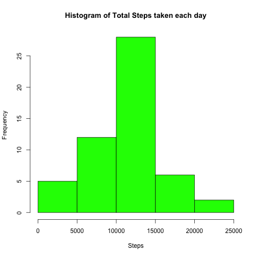
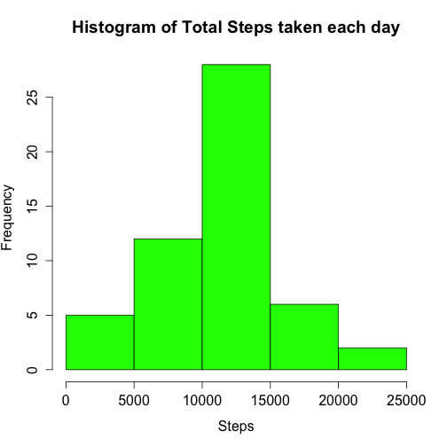
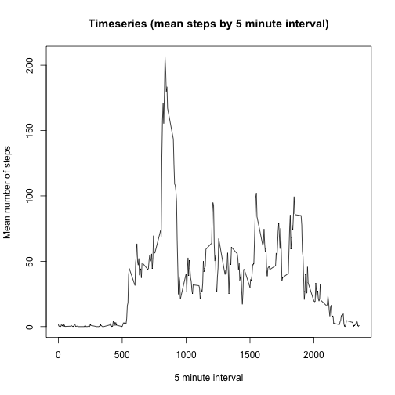
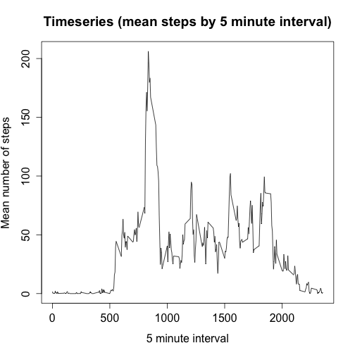
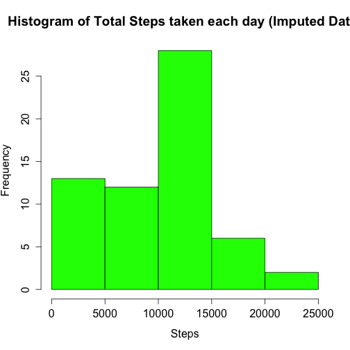
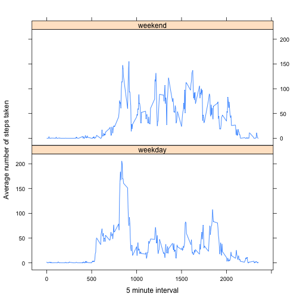

This is an R Markdown document. Markdown is a simple formatting syntax for authoring HTML, PDF, and MS Word documents. For more details on using R Markdown see <http://rmarkdown.rstudio.com>.

When you click the **Knit** button a document will be generated that includes both content as well as the output of any embedded R code chunks within the document. You can embed an R code chunk like this:

## Loading and preprocessing the data


```r
fileUrl <- "https://d396qusza40orc.cloudfront.net/repdata%2Fdata%2Factivity.zip"
# Make a Data directory if one doesn't exist
if (!file.exists("../../Data"))
  dir.create("../../Data")
# Stored File Name
fn <- "../../Data/Factivity.zip" 
```

This will open the file & import the csv file into mydata:


```r
# Download file and store to table w/subset of table in datasub by dates
download.file(fileUrl, fn, method="curl")
dataDownloaded <- date()
mycsv <- unzip(fn, exdir = "../../Data/")
mydata <- read.csv(mycsv, header = TRUE)
# Create a date for date variable...
mydata$datep <- as.POSIXlt(mydata$date, "%Y-%m-%d", tz="")
```
## What is mean total number of steps taken per day?


```r
# Calculate the total number of steps taken per day
rtotal <- aggregate(steps ~ date, mydata, sum)
print("Total number of steps taken per day is:")
```

```
## [1] "Total number of steps taken per day is:"
```

```r
print(rtotal)
```

```
##          date steps
## 1  2012-10-02   126
## 2  2012-10-03 11352
## 3  2012-10-04 12116
## 4  2012-10-05 13294
## 5  2012-10-06 15420
## 6  2012-10-07 11015
## 7  2012-10-09 12811
## 8  2012-10-10  9900
## 9  2012-10-11 10304
## 10 2012-10-12 17382
## 11 2012-10-13 12426
## 12 2012-10-14 15098
## 13 2012-10-15 10139
## 14 2012-10-16 15084
## 15 2012-10-17 13452
## 16 2012-10-18 10056
## 17 2012-10-19 11829
## 18 2012-10-20 10395
## 19 2012-10-21  8821
## 20 2012-10-22 13460
## 21 2012-10-23  8918
## 22 2012-10-24  8355
## 23 2012-10-25  2492
## 24 2012-10-26  6778
## 25 2012-10-27 10119
## 26 2012-10-28 11458
## 27 2012-10-29  5018
## 28 2012-10-30  9819
## 29 2012-10-31 15414
## 30 2012-11-02 10600
## 31 2012-11-03 10571
## 32 2012-11-05 10439
## 33 2012-11-06  8334
## 34 2012-11-07 12883
## 35 2012-11-08  3219
## 36 2012-11-11 12608
## 37 2012-11-12 10765
## 38 2012-11-13  7336
## 39 2012-11-15    41
## 40 2012-11-16  5441
## 41 2012-11-17 14339
## 42 2012-11-18 15110
## 43 2012-11-19  8841
## 44 2012-11-20  4472
## 45 2012-11-21 12787
## 46 2012-11-22 20427
## 47 2012-11-23 21194
## 48 2012-11-24 14478
## 49 2012-11-25 11834
## 50 2012-11-26 11162
## 51 2012-11-27 13646
## 52 2012-11-28 10183
## 53 2012-11-29  7047
```

```r
# Create a histogram of the total number of steps taken each day
png(filename = "plot1.png", width = 480, height = 480,
    units = "px")
hist(rtotal$steps, col ="green", bg="transparent", xlab = "Steps",
     main= "Histogram of Total Steps taken each day")
dev.off()
```

```
## RStudioGD 
##         2
```

```r
# Print to screen
hist(rtotal$steps, col ="green", bg="transparent", xlab = "Steps",
     main= "Histogram of Total Steps taken each day")
```

  

```r
# Calculate the mean total number of steps taken per day
rmean <- mean(rtotal$steps,na.rm=TRUE)
print(paste("The mean total of steps per day is:",rmean))
```

```
## [1] "The mean total of steps per day is: 10766.1886792453"
```

```r
# Calculate the mean total number of steps taken per day
rmedian <- median(rtotal$steps,na.rm=TRUE)
print(paste("The median total of steps per day is:",rmedian))
```

```
## [1] "The median total of steps per day is: 10765"
```

## What is the average daily activity pattern?


```r
int5 <- aggregate(steps ~ interval, mydata, mean)
png(filename = "plot2.png", width = 480, height = 480,
    units = "px")
plot(int5$steps ~int5$interval, type="l", xlab="5 minute interval", ylab="Mean number of steps", main="Timeseries (mean steps by 5 minute interval)")
dev.off()
```

```
## RStudioGD 
##         2
```

```r
#Print plot to screen
plot(int5$steps ~int5$interval, type="l", xlab="5 minute interval", ylab="Mean number of steps", main="Timeseries (mean steps by 5 minute interval)")
```

  

```r
# Calculate the maximum interval
print(paste("The time interval containing the maximum number of steps on average is:",int5$interval[max(int5$steps)==int5$steps]))
```

```
## [1] "The time interval containing the maximum number of steps on average is: 835"
```

## Imputing missing values


```r
nna <- sum(is.na(mydata$steps))
print(paste("The number of NAs stored in steps is:", nna))
```

```
## [1] "The number of NAs stored in steps is: 2304"
```

```r
# Find and fill missing steps with the meadian value at the interval
imval <- aggregate(steps ~ interval, mydata, median)
mydatanm <- mydata
for (i in 1:dim(mydata)[1]){
    if (is.na(mydatanm$steps[i])){ 
        index <- 1
        found <- FALSE
        while (!found & index <= dim(imval)[1]){
            if (mydatanm$interval[i] == imval$interval[index]){
                found <- TRUE
                mydatanm$steps[i] <- imval$steps[index]
            }
            else
                index <- index + 1
        }
    }
}
print(paste("The number of NAs stored in steps nowis:", sum(is.na(mydatanm$steps))))
```

```
## [1] "The number of NAs stored in steps nowis: 0"
```

```r
# Summaries on imputed data
# Calculate the total number of steps taken per day
rtotalim <- aggregate(steps ~ date, mydatanm, sum)
print("Total number of steps taken per day is:")
```

```
## [1] "Total number of steps taken per day is:"
```

```r
print(rtotalim)
```

```
##          date steps
## 1  2012-10-01  1141
## 2  2012-10-02   126
## 3  2012-10-03 11352
## 4  2012-10-04 12116
## 5  2012-10-05 13294
## 6  2012-10-06 15420
## 7  2012-10-07 11015
## 8  2012-10-08  1141
## 9  2012-10-09 12811
## 10 2012-10-10  9900
## 11 2012-10-11 10304
## 12 2012-10-12 17382
## 13 2012-10-13 12426
## 14 2012-10-14 15098
## 15 2012-10-15 10139
## 16 2012-10-16 15084
## 17 2012-10-17 13452
## 18 2012-10-18 10056
## 19 2012-10-19 11829
## 20 2012-10-20 10395
## 21 2012-10-21  8821
## 22 2012-10-22 13460
## 23 2012-10-23  8918
## 24 2012-10-24  8355
## 25 2012-10-25  2492
## 26 2012-10-26  6778
## 27 2012-10-27 10119
## 28 2012-10-28 11458
## 29 2012-10-29  5018
## 30 2012-10-30  9819
## 31 2012-10-31 15414
## 32 2012-11-01  1141
## 33 2012-11-02 10600
## 34 2012-11-03 10571
## 35 2012-11-04  1141
## 36 2012-11-05 10439
## 37 2012-11-06  8334
## 38 2012-11-07 12883
## 39 2012-11-08  3219
## 40 2012-11-09  1141
## 41 2012-11-10  1141
## 42 2012-11-11 12608
## 43 2012-11-12 10765
## 44 2012-11-13  7336
## 45 2012-11-14  1141
## 46 2012-11-15    41
## 47 2012-11-16  5441
## 48 2012-11-17 14339
## 49 2012-11-18 15110
## 50 2012-11-19  8841
## 51 2012-11-20  4472
## 52 2012-11-21 12787
## 53 2012-11-22 20427
## 54 2012-11-23 21194
## 55 2012-11-24 14478
## 56 2012-11-25 11834
## 57 2012-11-26 11162
## 58 2012-11-27 13646
## 59 2012-11-28 10183
## 60 2012-11-29  7047
## 61 2012-11-30  1141
```

```r
# Create a histogram of the total number of steps taken each day
png(filename = "plot3.png", width = 480, height = 480,
    units = "px")
hist(rtotalim$steps, col ="green", bg="transparent", xlab = "Steps",
     main= "Histogram of Total Steps taken each day (Imputed Data)")
dev.off()
```

```
## RStudioGD 
##         2
```

```r
# Print to screen
hist(rtotalim$steps, col ="green", bg="transparent", xlab = "Steps",
     main= "Histogram of Total Steps taken each day (Imputed Data)")
```

  

```r
# Calculate the mean total number of steps taken per day
rmeanim <- mean(rtotalim$steps)
print(paste("The mean total of steps per day with imputation is:",rmeanim))
```

```
## [1] "The mean total of steps per day with imputation is: 9503.86885245902"
```

```r
# Calculate the mean total number of steps taken per day
rmedianim <- median(rtotalim$steps)
print(paste("The median total of steps per day is:",rmedianim))
```

```
## [1] "The median total of steps per day is: 10395"
```

```r
# Answer questions:
print(paste("The total number of steps taken increases by", sum(rtotalim$steps)- sum(rtotal$steps), "with imputation."))
```

```
## [1] "The total number of steps taken increases by 9128 with imputation."
```

```r
print(paste("The mean number of steps taken each day increases by", rmeanim-rmean, "with imputation."))
```

```
## [1] "The mean number of steps taken each day increases by -1262.31982678627 with imputation."
```

```r
print(paste("The median number of steps taken each day decreases by", rmedian-rmedianim, "with imputation."))
```

```
## [1] "The median number of steps taken each day decreases by 370 with imputation."
```

## Are there differences in activity patterns between weekdays and weekends?


```r
mydatanm$wkd <- "weekday"
for (i in 1:dim(mydatanm)[1]){
    if (weekdays(mydatanm$datep[i]) == "Sunday" | 
        weekdays(mydatanm$datep[i]) == "Saturday")
        mydatanm$wkd[i] <- "weekend"
}
mydatanm$wkd <-factor(mydatanm$wkd)
dtp <- aggregate(steps~interval*wkd,mydatanm,mean)
library(lattice)
#print to the file
trellis.device(device="png",filename="plot4.png")
p <- xyplot(dtp$steps~dtp$interval|dtp$wkd,dtp,type="l",layout=c(1,2), 
       xlab="5 minute interval", ylab="Average number of steps taken")
print(p)
dev.off()
```

```
## RStudioGD 
##         2
```

```r
#Print to screen
print (p)
```

  


